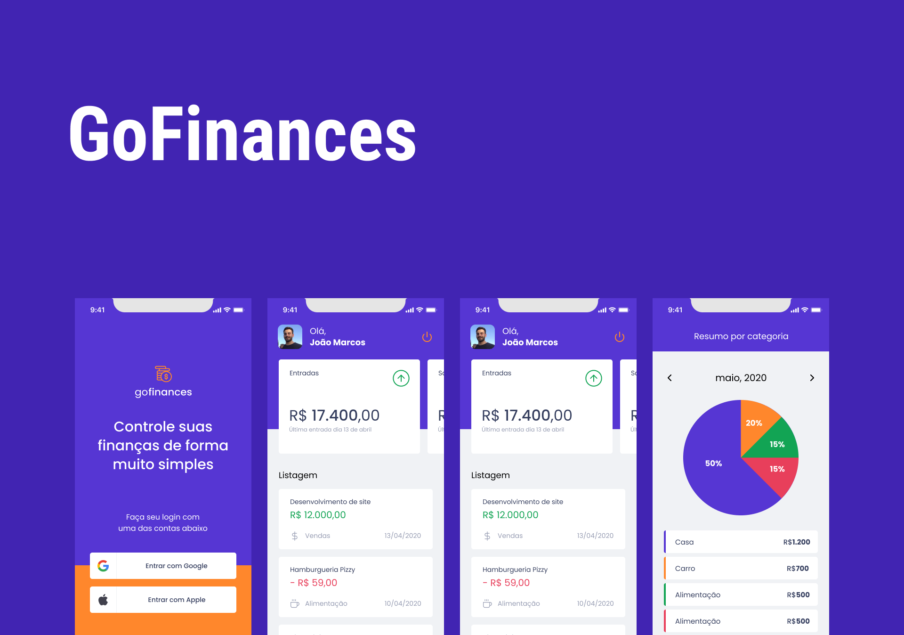

## GoFinances


<h1 align="center">
  
</h1>


<p align="center">
  

 
</p>


## 💻 Projeto

O GoFinances é um App para financias para que seu usuário tenha um melhor gerenciamento de seu capital.

## :hammer_and_wrench: Features

- [x] Armazenamento em banco de dados local.
- [x] OAuth com Google e Apple.

## ✨ Tecnologias

- [x] Expo
- [x] Typescript
- [x] Jest
- [x] Testing-Library
- [x] React Hook Form
- [x] Date-FNS
- [x] CI-CD
- [x] Code push (OTA)

## Executando o projeto

Entre na pasta "mobile" e "server" e tilize o **yarn** ou o **npm install** para instalar as dependências do projeto.
Em seguida, inicie o projeto.

### Rodando com Expo

```cl
expo start
```

No console irá aparecer o QR Code em seu celular com o app do expo instalado escaneie o código e já estará rodando.

### Rodando com React-Native

```cl
    yarn start
```

<div align="center">
  <p>Desenvolvido por João Marcos</p>

  [](https://www.linkedin.com/in/jo%C3%A3o-marcos-belanga-60b8071b6/)
</div>